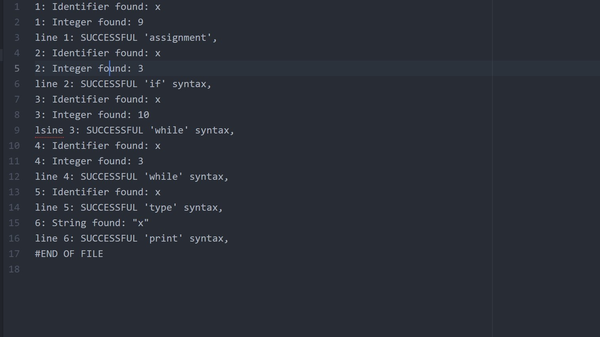

# SyntaxAnalyzer
A simple syntax analyzer of mini python language.

<h1>How to run it</h1>

 <p>To Run this syntax analyzer and check the validity of this grammar follow the below commands.
  Open a terminal in a UNIX os and cd into project folder.</p>
 

  1. First of all build all the files.
  ```
   $ make
  ```
  
  2. After that test the grammar validity.Open the input.txt file and write a code that follows the syntax of this grammar.This command will make an output file with the success syntax of your code and the all the lexical or syntax errors.Hit the below command all that i mentioned:
 ```
   $ ./parser input.txt output.txt
 ```

<h2>Sample of Grammar</h2>

<dl>
<dt>input.txt<dt>
  <dd><p align="center">
  
</p><dd>
 
 <dt>output.txt<dt>
  <dd><p align="center">
  
</p><dd>
 
 </dl>
